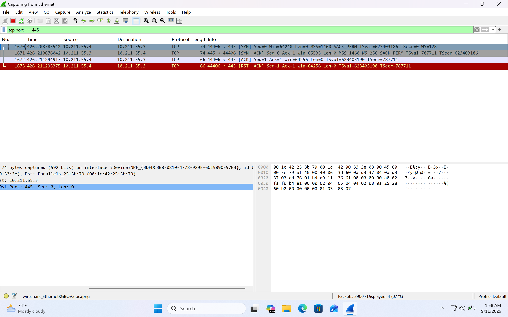
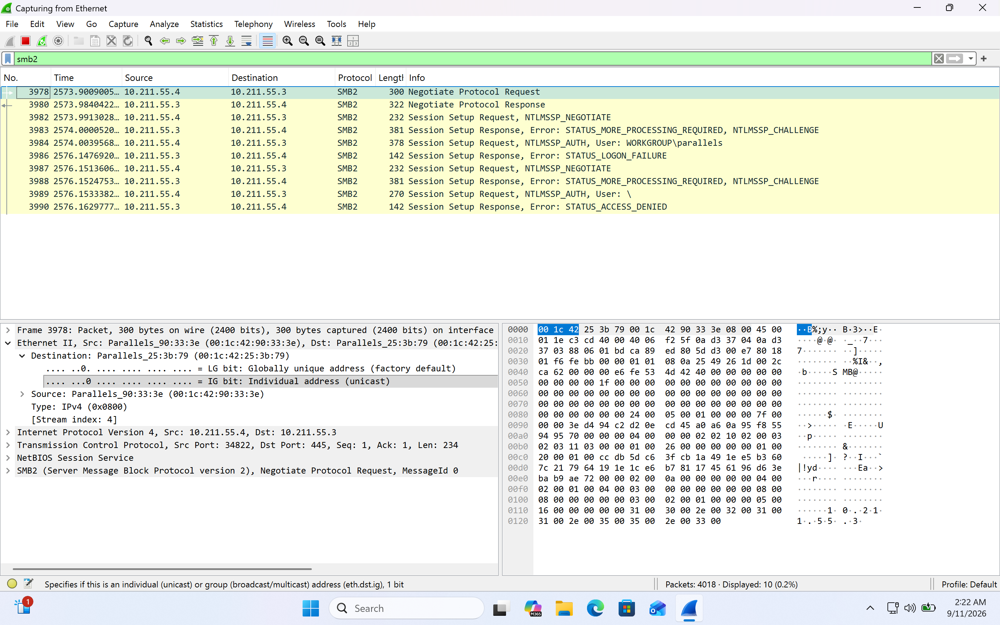
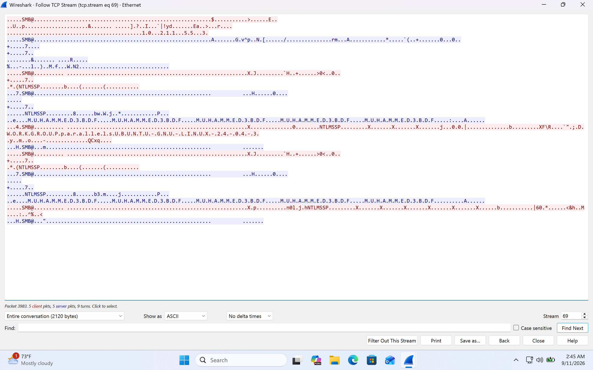
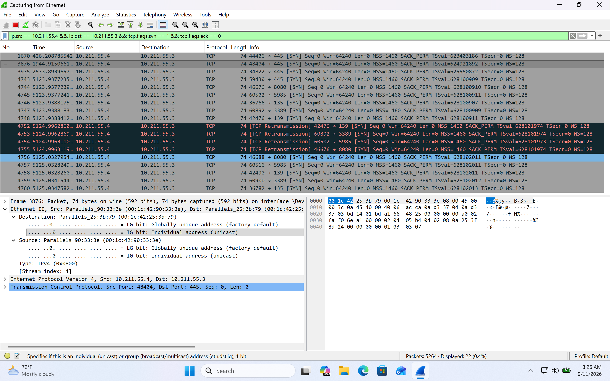

# Network Traffic Investigation(WireShark)

## Overview

This project documents a hands-on network traffic investigation performed in an isolated home lab using **Wireshark, Nmap, Ubuntu Linux, and Windows 11**.

The objective was to generate controlled network activity, capture the traffic, analyze TCP and SMB communications, identify failed authentication attempts, and recognize network reconnaissance patterns.

The investigation demonstrates foundational skills used by SOC analysts and security analysts when analyzing packet captures and investigating suspicious network behavior.

---

## Lab Environment

| System     | Operating System          | IP Address       | Role                    |
| ---------- | ------------------------- | ---------------- | ----------------------- |
| Ubuntu VM  | Ubuntu 24.04.3 ARM64      | `10.211.55.4`    | Testing / scanning host |
| Windows VM | Windows 11 ARM64          | `10.211.55.3`    | Target / monitored host |
| Network    | Parallels Private Network | `10.211.55.0/24` | Isolated lab network    |

### Tools Used

* Wireshark
* Nmap 7.94SVN
* Ubuntu Linux
* Windows 11
* SMB2
* NTLMSSP
* TCP/IP

---

# Investigation Objectives

The investigation focused on four primary objectives:

1. Analyze TCP connectivity between Ubuntu and Windows.
2. Identify an exposed SMB service on TCP port 445.
3. Analyze SMB2 and NTLM authentication traffic.
4. Identify a TCP port-scanning pattern using packet-level evidence.

---

# Investigation 1 — TCP Handshake

An Nmap TCP Connect scan was performed against Windows:

```bash
nmap -Pn -sT -p 445 10.211.55.3
```

Wireshark captured the TCP three-way handshake:

```text
10.211.55.4 → 10.211.55.3    SYN
10.211.55.3 → 10.211.55.4    SYN/ACK
10.211.55.4 → 10.211.55.3    ACK
10.211.55.4 → 10.211.55.3    RST/ACK
```

### Finding

The SYN/ACK response from Windows confirmed that TCP port **445** was reachable and accepting connections.

The connection was subsequently reset because Nmap was performing reconnaissance rather than establishing a normal SMB session.

### Evidence



---

# Investigation 2 — SMB Authentication

An SMB connection attempt was generated using:

```bash
smbclient -L //10.211.55.3 -N
```

Wireshark identified SMB2 traffic and NTLM authentication messages.

Observed protocol activity included:

```text
SMB2 Negotiate Protocol Request
SMB2 Negotiate Protocol Response
NTLMSSP_NEGOTIATE
NTLMSSP_AUTH
STATUS_MORE_PROCESSING_REQUIRED
STATUS_LOGON_FAILURE
STATUS_ACCESS_DENIED
```

### Finding

The Windows host received SMB authentication attempts from the Ubuntu system and rejected the authentication.

The traffic demonstrated the sequence of an SMB2/NTLM authentication exchange.

The failed authentication activity was intentionally generated within the authorized home lab and was therefore classified as **benign test activity**.

### Evidence



---

# Investigation 3 — SMB TCP Stream Analysis

Wireshark's **Follow TCP Stream** functionality was used to reconstruct the SMB conversation.

The stream contained:

```text
SMB2
NTLMSSP
MUHAMMED3BDF
WORKGROUP
parallelsUBUNTU-GNU-LINUX-24-04-3
```

The TCP stream demonstrated that the SMB connection contained an NTLM authentication exchange between the two lab systems.

### Analyst Observation

Packet-level analysis can reveal useful system metadata, including:

* Hostnames
* Workgroup/domain information
* Authentication protocol
* Source and destination systems
* Authentication results

No attempt was made to obtain or crack credentials. The investigation focused on protocol behavior and authentication outcomes.

### Evidence



---

# Investigation 4 — TCP Port Scanning

A controlled Nmap scan was performed against multiple Windows ports:

```bash
nmap -Pn -sT -p 135,139,445,3389,5985,8080 10.211.55.3
```

The ports investigated were:

| Port | Common Service   |
| ---: | ---------------- |
|  135 | RPC              |
|  139 | NetBIOS/SMB      |
|  445 | SMB              |
| 3389 | RDP              |
| 5985 | WinRM            |
| 8080 | HTTP alternative |

Wireshark was filtered using:

```text
ip.src == 10.211.55.4 && ip.dst == 10.211.55.3 && tcp.flags.syn == 1 && tcp.flags.ack == 0
```

This isolated the initial TCP connection attempts generated by the Ubuntu scanning host.

### Finding

Multiple SYN packets were observed from the same source host to multiple destination ports on the Windows host.

This created a recognizable TCP reconnaissance pattern:

```text
10.211.55.4
     │
     ├── SYN → 135
     ├── SYN → 139
     ├── SYN → 445
     ├── SYN → 3389
     ├── SYN → 5985
     └── SYN → 8080
             │
             ▼
        10.211.55.3
```

### SOC Interpretation

In a production environment, repeated connection attempts from one source to multiple ports could represent:

* Authorized vulnerability scanning
* Network discovery
* Security testing
* Misconfigured software
* Malicious reconnaissance

Context is required before classifying the activity as malicious.

In this lab, the activity was intentionally generated using Nmap and is therefore classified as **authorized and benign**.

### Evidence



---

# Key Wireshark Filters

### SMB Traffic

```text
tcp.port == 445
```

### SMB2 Traffic

```text
smb2
```

### Initial TCP SYN Packets

```text
tcp.flags.syn == 1 && tcp.flags.ack == 0
```

### TCP SYN/ACK Responses

```text
tcp.flags.syn == 1 && tcp.flags.ack == 1
```

### Isolate the Ubuntu → Windows Scan

```text
ip.src == 10.211.55.4 && ip.dst == 10.211.55.3 && tcp.flags.syn == 1 && tcp.flags.ack == 0
```

---

# Detection Concepts

The investigation demonstrated several behaviors that could become SOC detections.

### Potential Detection 1 — TCP Port Scanning

**Behavior:**

One source IP attempts connections to multiple destination ports on the same host within a short time period.

**Example concept:**

```text
Same Source IP
       ↓
Multiple Destination Ports
       ↓
Multiple TCP SYN packets
       ↓
Potential Port Scan
```

---

### Potential Detection 2 — Repeated SMB Authentication Failures

**Behavior:**

A source repeatedly attempts authentication against SMB and receives authentication failures.

Potential indicators include:

```text
STATUS_LOGON_FAILURE
STATUS_ACCESS_DENIED
```

In a production environment, repeated failures could warrant investigation for credential misuse, password spraying, brute-force activity, or configuration problems.

---

# Investigation Summary

This project demonstrated how packet-level network analysis can be used to investigate activity between Linux and Windows systems.

The investigation progressed from basic connectivity to application-level analysis:

```text
TCP Connectivity
       ↓
Port 445 Discovery
       ↓
SMB2 Negotiation
       ↓
NTLM Authentication
       ↓
Authentication Failure
       ↓
TCP Port Scanning
       ↓
Reconnaissance Detection
```

The investigation reinforced the importance of analyzing **traffic patterns and context**, rather than treating individual packets as inherently malicious.

---

# Skills Demonstrated

* Wireshark packet capture
* Wireshark display filters
* TCP/IP analysis
* TCP three-way handshake analysis
* Nmap reconnaissance
* SMB2 traffic analysis
* NTLM authentication analysis
* Failed authentication investigation
* TCP port-scan identification
* Network reconnaissance detection
* Packet-level evidence collection
* SOC-style security analysis
* Security documentation

---

# Conclusion

The project successfully demonstrated a complete network traffic investigation using an isolated Ubuntu and Windows home lab.

The captured evidence showed:

* Successful TCP connectivity to Windows
* An accessible SMB service on TCP/445
* SMB2 negotiation
* NTLM authentication exchanges
* Failed SMB authentication
* Controlled TCP port scanning
* Packet-level indicators of network reconnaissance

All testing was performed between systems owned and controlled within the authorized home lab environment.
