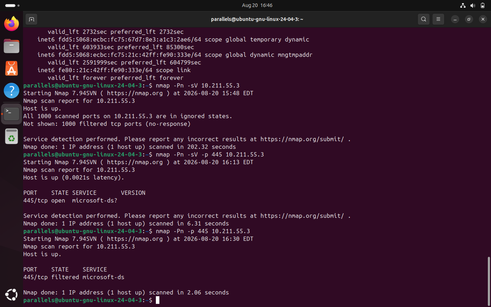
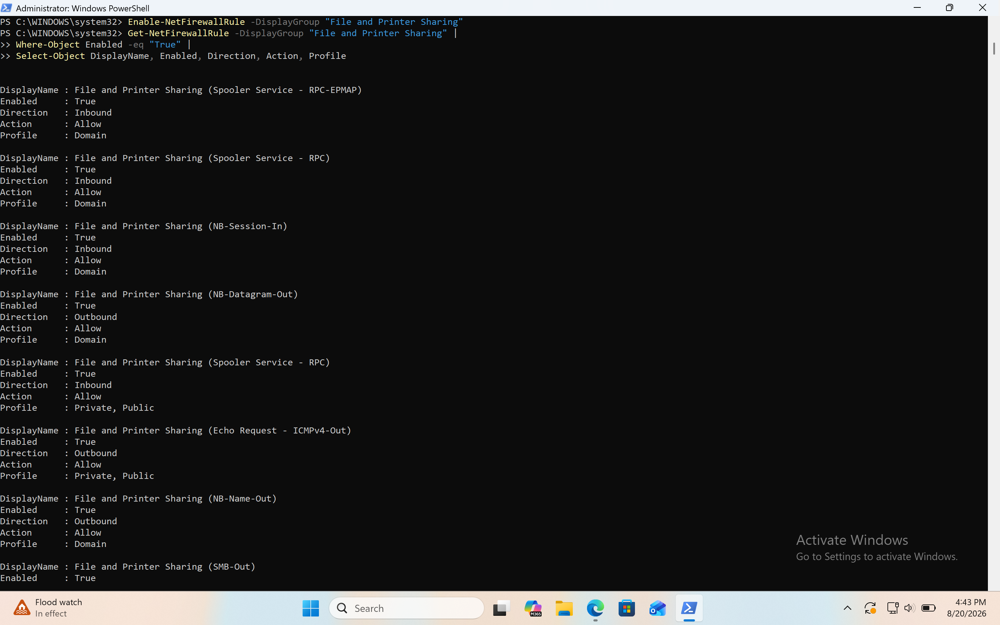
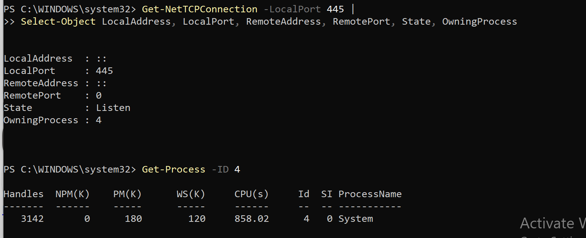
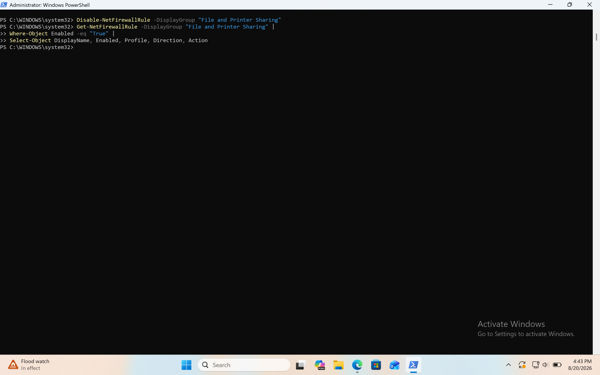

# Nmap Service & Version Identification

## Overview

This project documents a controlled service identification assessment of a Windows 11 virtual machine from an Ubuntu Linux security workstation.

The objective was to determine whether network services were accessible on the Windows host, identify the service associated with an exposed port, correlate Nmap results with host-level Windows evidence, investigate the process associated with the listening port, and validate the effect of Windows Firewall configuration.

The assessment was performed entirely within an authorized home laboratory environment using Parallels Desktop.

---

## Objectives

- Perform Nmap service and version detection.
- Understand how Nmap identifies network services.
- Distinguish between port state and service identification.
- Investigate TCP port 445.
- Correlate Nmap results with Windows host-level evidence.
- Identify the process associated with a listening network port.
- Understand the relationship between SMB and TCP 445.
- Demonstrate how Windows Firewall affects service accessibility.
- Validate findings through a controlled configuration change.
- Restore the system to its original security configuration after testing.

---

## Lab Environment

| Component | Configuration |
|---|---|
| Virtualization Platform | Parallels Desktop |
| Security Workstation | Ubuntu 24.04.3 ARM64 |
| Target System | Windows 11 ARM64 |
| Ubuntu IP Address | `10.211.55.4/24` |
| Windows IP Address | `10.211.55.3/24` |
| Network | `10.211.55.0/24` |
| Scanner | Nmap 7.94SVN |
| Primary Service Investigated | SMB / TCP 445 |
| Primary Tools | Nmap, PowerShell, Windows Firewall |

> **Authorization:** All scanning and configuration changes were performed against a personally controlled Windows virtual machine within a home laboratory environment.

---

# Network Topology

```text
                    Parallels Virtual Network
                         10.211.55.0/24
                               |
                +--------------+--------------+
                |                             |
                |                             |
        Ubuntu 24.04.3                  Windows 11
        Security Workstation            Target VM
        10.211.55.4                     10.211.55.3
                |                             |
                |                             |
                +-------- Security Lab -------+
````

---

# Investigation Methodology

The investigation followed a controlled and evidence-based process:

```text
Initial Nmap Assessment
          ↓
Service Detection
          ↓
Targeted Port Investigation
          ↓
Windows Host Verification
          ↓
Process Correlation
          ↓
Firewall Validation
          ↓
Controlled Configuration Change
          ↓
Service Identification
          ↓
Firewall Restoration
          ↓
Final Verification
```

The goal was to correlate external network observations with evidence obtained directly from the target Windows system.

---

# 1. Initial Service Detection

The first service detection scan was performed from Ubuntu:

```bash
nmap -Pn -sV 10.211.55.3
```

Nmap returned:

```text
Host is up.

All 1000 scanned ports on 10.211.55.3 are in ignored states.
Not shown: 1000 filtered tcp ports (no-response)

Service detection performed.
```

### Analysis

The Windows host was confirmed to be online, but all 1,000 default TCP ports were filtered.

Because Nmap could not establish connections to the ports, it could not perform meaningful service identification.

This demonstrated an important limitation of service detection:

> **Nmap cannot reliably identify a service when network filtering prevents it from communicating with the service.**

---

# 2. Targeted Investigation of TCP 445

TCP port 445 was selected for further investigation because Windows had previously reported the port as listening.

A targeted scan was performed:

```bash
nmap -Pn -sV -p 445 10.211.55.3
```

Nmap returned:

```text
PORT    STATE SERVICE       VERSION
445/tcp open  microsoft-ds?
```

### Findings

| Field         | Result         |
| ------------- | -------------- |
| Port          | `445/tcp`      |
| State         | `open`         |
| Service       | `microsoft-ds` |
| Exact Version | Not identified |
| Host          | `10.211.55.3`  |

---

# 3. Understanding the Nmap Result

The result:

```text
445/tcp open microsoft-ds?
```

contains several pieces of information.

### `445/tcp`

The service is communicating over TCP port 445.

### `open`

Nmap successfully established that something was accepting connections on the port.

### `microsoft-ds`

Nmap associated the response with Microsoft's `microsoft-ds` service designation, commonly associated with SMB.

### `?`

The question mark indicates that Nmap was not completely confident in the service identification.

Therefore, the result should not be interpreted as:

> "Nmap definitively identified the exact software version."

Instead:

> "Nmap observed a service on TCP 445 that is consistent with Microsoft-DS/SMB, but the exact version could not be determined."

---

# 4. Windows Host-Side Verification

The Nmap finding was independently verified from the Windows target.

The following PowerShell command was used:

```powershell
Get-NetTCPConnection -LocalPort 445 |
Select-Object LocalAddress, LocalPort, RemoteAddress, RemotePort, State, OwningProcess
```

The result showed:

```text
LocalAddress  : ::
LocalPort     : 445
RemoteAddress : ::
RemotePort    : 0
State         : Listen
OwningProcess : 4
```

### Finding

Windows confirmed that TCP 445 was actively listening.

The listener was associated with:

```text
OwningProcess: 4
```

---

# 5. Process Correlation

The owning process was investigated using:

```powershell
Get-Process -Id 4
```

Windows returned:

```text
Id          : 4
ProcessName : System
```

### Analysis

TCP 445 was associated with Windows' `System` process rather than a conventional user-level application.

This provided additional host-side evidence supporting the Nmap observation.

---

# 6. Evidence Correlation

The investigation now had evidence from multiple sources.

### Network-level evidence

Nmap:

```text
445/tcp open microsoft-ds?
```

### Host-level network evidence

Windows:

```text
445 → Listen
```

### Process-level evidence

Windows:

```text
PID 4 → System
```

### Correlated conclusion

```text
                 WINDOWS
                    │
             TCP 445 LISTEN
                    │
                 PID 4
                    │
                 System
                    │
                    ▼
              SMB-related
              functionality
                    │
             Firewall permits
                    │
                    ▼
                 UBUNTU
                    │
                  Nmap
                    │
                    ▼
          445/tcp OPEN
          microsoft-ds?
```

The independent observations were consistent with one another.

---

# 7. Windows Firewall Investigation

The Windows Firewall configuration was investigated to understand why the same service could appear filtered during one scan and open during another.

The relevant Windows Firewall rules were associated with:

```text
File and Printer Sharing (SMB-In)
```

The rules were initially disabled.

This explained why a service could be listening locally while remaining inaccessible from Ubuntu.

---

# 8. Controlled Firewall Experiment

To validate the relationship between the firewall configuration and network exposure, the SMB firewall rules were temporarily enabled within the controlled laboratory environment.

Command:

```powershell
Enable-NetFirewallRule -DisplayGroup "File and Printer Sharing"
```

A targeted Nmap service scan was then performed:

```bash
nmap -Pn -sV -p 445 10.211.55.3
```

The result was:

```text
PORT    STATE SERVICE       VERSION
445/tcp open  microsoft-ds?
```

### Analysis

The service became remotely accessible once the corresponding firewall rules allowed inbound SMB traffic.

This provided direct experimental evidence that the Windows Firewall was controlling the remote exposure of TCP 445.

---

# 9. Firewall Restoration

After completing the controlled test, the SMB firewall rules were disabled:

```powershell
Disable-NetFirewallRule -DisplayGroup "File and Printer Sharing"
```

A final targeted Nmap scan was then performed:

```bash
nmap -Pn -p 445 10.211.55.3
```

TCP 445 returned to a:

```text
filtered
```

state.

### Validation

The complete experiment therefore produced:

```text
Initial state
     ↓
445/tcp → FILTERED
     ↓
Enable SMB firewall rules
     ↓
445/tcp → OPEN
     ↓
Nmap → microsoft-ds?
     ↓
Windows → 445 LISTEN
     ↓
Disable SMB firewall rules
     ↓
445/tcp → FILTERED
```

This confirmed that the configuration change was responsible for the change in remote network visibility.

---

# 10. Security Analysis

TCP 445 is commonly associated with SMB, which provides Windows network file and resource-sharing functionality.

An open SMB port does **not** automatically indicate malicious activity.

However, an analyst should determine:

* Is SMB required?
* Is the system supposed to provide file sharing?
* Which systems are allowed to access it?
* Is access restricted to the appropriate network?
* Are unnecessary inbound connections blocked?
* Are there suspicious SMB authentication attempts?
* Are there unexpected connections to or from the host?
* Is the service properly maintained and secured?

The appropriate response depends on the organization's network architecture and security policy.

---

# 11. Key Findings

## Finding 1 — Service detection depends on network accessibility

Nmap's initial `-sV` scan could not identify services because all scanned ports were filtered.

### Security implication

A lack of service identification does not necessarily mean that no services are running.

Network filtering may prevent an external scanner from reaching them.

---

## Finding 2 — TCP 445 was confirmed as listening

Windows confirmed:

```text
TCP 445 → LISTEN
```

### Security implication

A service was actively listening locally on the Windows system.

---

## Finding 3 — Nmap identified Microsoft-DS/SMB behavior

Nmap identified:

```text
445/tcp open microsoft-ds?
```

### Security implication

The network response was consistent with Microsoft's SMB-related service designation.

The `?` indicates that the exact service identification/version was not fully confirmed by Nmap.

---

## Finding 4 — Firewall configuration controlled exposure

TCP 445 changed from:

```text
FILTERED
```

to:

```text
OPEN
```

when the relevant inbound firewall rules were temporarily enabled.

After the rules were disabled, the port returned to:

```text
FILTERED
```

### Security implication

Windows Firewall directly influenced whether the locally listening service was remotely accessible.

---

# 12. Important Security Principle

The investigation demonstrated:

```text
Listening Service
       ≠
Remotely Accessible Service
```

A host may have a service listening locally while network controls prevent other systems from reaching it.

Therefore, assessing network exposure requires both:

```text
Host-side evidence
        +
Network-side evidence
```

---

# 13. Lessons Learned

This lab reinforced the following concepts:

### Nmap service detection

The `-sV` option attempts to determine what service is running on an accessible port.

### Port state

An `open` port means Nmap received evidence that a service is accepting connections.

### Service identification

A service name reported by Nmap should be treated as an identification result rather than unquestionable proof.

### Host verification

PowerShell can independently confirm whether a port is listening.

### Process correlation

A listening port can be associated with the process responsible for the listener.

### Firewall behavior

A firewall can make a locally listening service appear `filtered` to remote scanners.

### Evidence correlation

Using multiple sources provides stronger evidence than relying on a single tool.

---

# Tools Used

* Parallels Desktop
* Ubuntu 24.04.3 ARM64
* Windows 11 ARM64
* Nmap 7.94SVN
* Windows PowerShell
* Windows Defender Firewall
* TCP/IP
* SMB

---

# Commands Used

## Ubuntu

### Service/version detection

```bash
nmap -Pn -sV 10.211.55.3
```

### Targeted service detection

```bash
nmap -Pn -sV -p 445 10.211.55.3
```

### Final verification

```bash
nmap -Pn -p 445 10.211.55.3
```

---

## Windows PowerShell

### Identify listening port

```powershell
Get-NetTCPConnection -LocalPort 445 |
Select-Object LocalAddress, LocalPort, RemoteAddress, RemotePort, State, OwningProcess
```

### Identify owning process

```powershell
Get-Process -Id 4
```

### Enable SMB firewall rules for controlled testing

```powershell
Enable-NetFirewallRule -DisplayGroup "File and Printer Sharing"
```

### Disable SMB firewall rules after testing

```powershell
Disable-NetFirewallRule -DisplayGroup "File and Printer Sharing"
```

---

# Evidence






---

# Conclusion

This assessment demonstrated how Nmap can be used to identify accessible network services and how those results can be correlated with host-level evidence from Windows.

The investigation confirmed that TCP 445 was listening on the Windows host and that Nmap identified the response as consistent with Microsoft-DS/SMB.

The controlled firewall experiment further demonstrated that a service can be running locally while remaining inaccessible to remote systems because of firewall restrictions.

The final cleanup returned the service to its original filtered state.

The primary takeaway from this lab is:

> **Service identification requires network accessibility, and network exposure must be evaluated alongside host-level evidence and firewall configuration.**

This investigation establishes a foundation for future labs involving **Windows Event Logs, authentication events, network traffic analysis, SIEM investigation, Microsoft Sentinel, and SOC detection engineering.**
