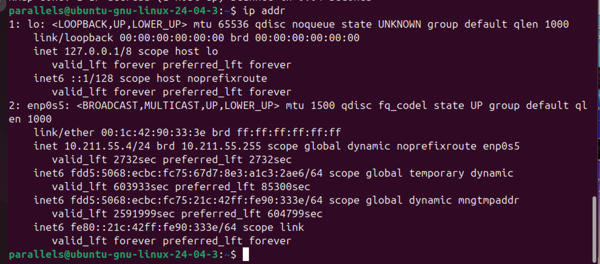
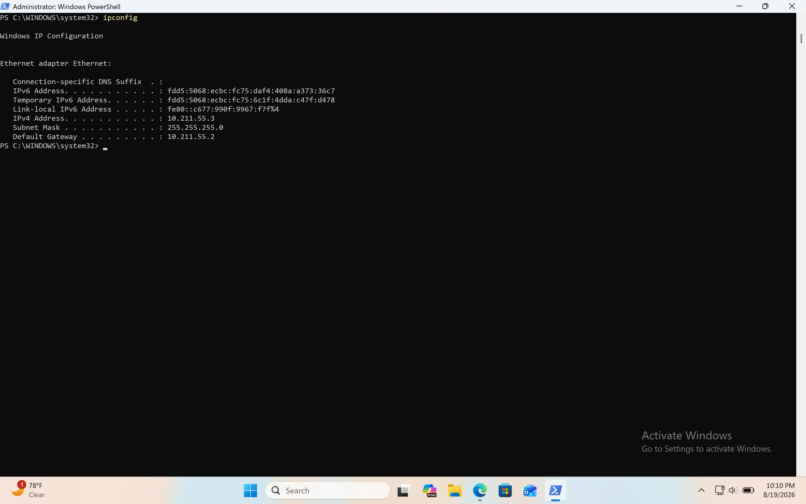
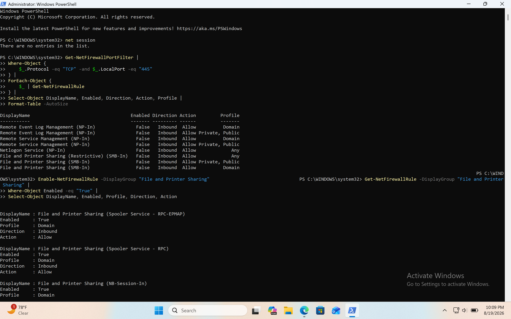
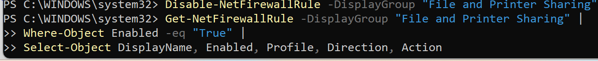
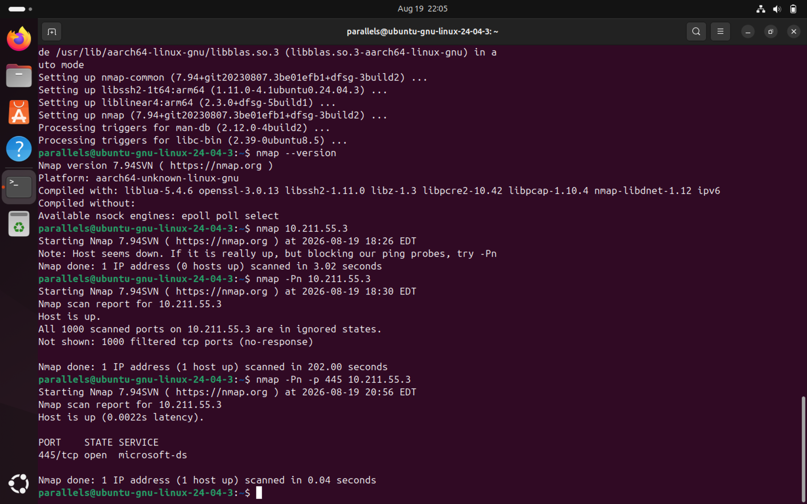

| Category | Result |
|---|---|
| **Assessment Type** | Internal network exposure assessment |
| **Target** | Windows 11 VM |
| **Target IP** | `10.211.55.3` |
| **Source** | Ubuntu security VM |
| **Primary Tool** | Nmap |
| **Key Service Investigated** | SMB / TCP 445 |
| **Primary Finding** | Firewall controls remote accessibility |
| **Risk Context** | Lab environment / controlled |
| **Status** | Completed |
# Windows Network Exposure Assessment

## Overview

This project documents a controlled network security assessment of a Windows 11 virtual machine from an Ubuntu Linux security workstation.

The objective was to identify network exposure, distinguish between locally listening services and remotely accessible services, investigate Windows Firewall behavior, and validate findings using both network-level and host-level evidence.

The assessment was performed entirely within an isolated, authorized home laboratory environment using Parallels Desktop.

---

## Objectives

- Establish and verify connectivity between Linux and Windows virtual machines.
- Identify the target Windows host and its network configuration.
- Perform TCP host and port discovery using Nmap.
- Understand the difference between `open`, `closed`, and `filtered` ports.
- Investigate why Nmap initially reported the host as unavailable.
- Compare Nmap results with Windows host-side listening ports.
- Investigate Windows Firewall configuration.
- Demonstrate how firewall rules affect remote service accessibility.
- Document findings using an evidence-based security investigation process.
- Restore the Windows VM to its original security configuration after testing.

---

## Lab Environment

| Component | Configuration |
|---|---|
| Virtualization Platform | Parallels Desktop |
| Security Workstation | Ubuntu 24.04.3 ARM64 |
| Target System | Windows 11 ARM64 |
| Ubuntu IP Address | `10.211.55.4/24` |
| Windows IP Address | `10.211.55.3/24` |
| Network | `10.211.55.0/24` |
| Scanner | Nmap 7.94SVN |
| Primary Protocols | ICMP, TCP |
| Target Service Investigated | SMB / TCP 445 |

> **Authorization:** All scanning and configuration changes were performed against a personally controlled Windows virtual machine within a home laboratory environment.

---

# Network Topology

```text
                    Parallels Virtual Network
                         10.211.55.0/24
                               |
                +--------------+--------------+
                |                             |
                |                             |
        Ubuntu 24.04.3                  Windows 11
        Security Workstation            Target VM
        10.211.55.4                     10.211.55.3
                |                             |
                |                             |
                +-------- Security Lab -------+
````

---

# Investigation Methodology

The investigation followed a progressive approach:

```text
Connectivity
     ↓
Host Discovery
     ↓
Port Scanning
     ↓
Host-Side Verification
     ↓
Firewall Investigation
     ↓
Controlled Configuration Change
     ↓
Targeted Rescan
     ↓
Cleanup
     ↓
Security Finding
```

This approach was used to avoid making assumptions based solely on scanner output.

---

# 1. Connectivity Verification

The first step was determining whether the two virtual machines could communicate.

From Windows, the Ubuntu system was tested using:

```powershell
ping 10.211.55.4
```

The result was:

```text
Packets: Sent = 4
Received = 4
Lost = 0 (0% loss)
```

This confirmed that Windows could successfully communicate with Ubuntu.

Ubuntu initially received no ICMP responses when testing Windows:

```bash
ping -c 4 10.211.55.3
```

Result:

```text
4 packets transmitted
0 received
100% packet loss
```

### Initial Observation

The failed ping did not establish that Windows was offline.

It indicated that ICMP traffic from Ubuntu to Windows was not receiving a response.

This distinction became important during subsequent Nmap testing.

---

# 2. Initial Nmap Host Discovery

A basic Nmap scan was performed from Ubuntu:

```bash
nmap 10.211.55.3
```

Nmap returned:

```text
Note: Host seems down.
If it is really up, but blocking our ping probes, try -Pn
```

### Analysis

Nmap's result was consistent with the earlier failed ICMP test.

However, the result did not prove that the Windows host was offline.

A host firewall can interfere with Nmap's host discovery probes.

---

# 3. Nmap Host Discovery Bypass

Nmap was instructed to skip host discovery and treat the target as online:

```bash
nmap -Pn 10.211.55.3
```

Nmap returned:

```text
Nmap scan report for 10.211.55.3
Host is up.

All 1000 scanned ports on 10.211.55.3 are in ignored states.
Not shown: 1000 filtered tcp ports (no-response)
```

### Finding

The Windows host was confirmed to be reachable.

However, all 1,000 default TCP ports scanned by Nmap were reported as:

```text
filtered
```

This indicated that Nmap was not receiving responses that allowed it to determine whether the ports were open or closed.

---

# 4. Host-Side Port Investigation

Nmap results were compared with information directly from Windows.

The following PowerShell command was used:

```powershell
Get-NetTCPConnection -State Listen
```

Several listening TCP ports were identified, including:

```text
135
139
445
5040
49664+
```

Examples included:

```text
0.0.0.0:135
10.211.55.3:139
0.0.0.0:445
0.0.0.0:5040
0.0.0.0:49664+
```

### Important Observation

Windows confirmed that multiple services were listening locally.

However, Nmap reported the corresponding remote ports as filtered.

This demonstrated an important security principle:

> **A service listening on a host does not necessarily mean that the service is remotely accessible.**

Host-based firewall controls can affect whether a listening service can be reached from another system.

---

# 5. Windows Firewall Investigation

The Windows network profile was checked using:

```powershell
Get-NetConnectionProfile |
Format-Table Name, InterfaceAlias, NetworkCategory, IPv4Connectivity
```

The Windows VM was identified as using the:

```text
NetworkCategory: Public
```

Windows Firewall was confirmed to be enabled.

Firewall rules associated with SMB were then investigated.

Port 445 was particularly relevant because it is commonly associated with:

```text
SMB — Server Message Block
```

The Windows firewall configuration contained rules for:

```text
File and Printer Sharing (SMB-In)
```

These rules were initially disabled.

---

# 6. Controlled Firewall Experiment

To validate whether firewall configuration was responsible for the difference between local listening state and remote Nmap visibility, the SMB firewall rules were temporarily enabled within the controlled laboratory environment.

Command:

```powershell
Enable-NetFirewallRule -DisplayGroup "File and Printer Sharing"
```

A targeted Nmap scan was then performed from Ubuntu:

```bash
nmap -Pn -p 445 10.211.55.3
```

Before the firewall change, TCP 445 was not remotely accessible.

After the controlled firewall change, TCP 445 became:

```text
445/tcp    open    microsoft-ds
```

### Interpretation

The controlled experiment demonstrated that Windows Firewall configuration was affecting remote access to TCP 445.

The result changed from a filtered state to an open state when the appropriate inbound SMB firewall rules were enabled.

---

# 7. Security Analysis

The investigation demonstrated several important differences between host-level and network-level observations.

### Host-level observation

Windows reported:

```text
TCP 445 → LISTEN
```

This means a process was listening for connections on the host.

### Network-level observation

Nmap initially reported the port as inaccessible from Ubuntu.

This means the service was not necessarily exposed to the scanning host.

### Security principle

```text
Listening Service
       ≠
Remotely Accessible Service
```

A firewall can create a security boundary between the service and external systems.

---

# 8. Key Findings

## Finding 1 — ICMP filtering affected host discovery

Nmap initially reported the Windows host as potentially down.

Using `-Pn` confirmed that the host was actually reachable.

### Security implication

Analysts should not automatically interpret failed ICMP responses as evidence that a system is offline.

---

## Finding 2 — Windows had multiple listening services

Windows reported multiple TCP listeners, including TCP 135, 139, 445, and dynamic RPC ports.

### Security implication

Listening services should be reviewed to determine:

* What application owns the port?
* Is the service expected?
* Is the service required?
* Who can reach it?
* Is it appropriately protected?

---

## Finding 3 — TCP 445 was locally listening but initially filtered remotely

Windows showed TCP 445 in a listening state while Nmap could not initially reach it.

### Security implication

Host firewall configuration can restrict access to services even when those services are running.

---

## Finding 4 — Firewall configuration directly affected network exposure

After temporarily enabling the SMB inbound firewall rules, Nmap identified TCP 445 as open.

### Security implication

Firewall configuration is an important component of a host's network exposure.

---

# 9. Remediation and Cleanup

After completing the controlled experiment, the SMB firewall rules were disabled:

```powershell
Disable-NetFirewallRule -DisplayGroup "File and Printer Sharing"
```

This restored the Windows VM to its previous lab configuration.

No unnecessary firewall exposure was intentionally left enabled after testing.

---

# 10. Lessons Learned

This investigation reinforced the following concepts:

### Host discovery

A failed ping does not necessarily mean a host is offline.

### Port states

* **Open:** A service appears to be accepting connections.
* **Closed:** The host is reachable but no service is listening on that port.
* **Filtered:** Nmap cannot determine the port state because filtering or lack of response interferes with the probe.

### Firewall behavior

A firewall can prevent remote access to a service that is otherwise listening locally.

### Network vs. host evidence

Nmap provides an external perspective of network exposure, while Windows PowerShell provides a host-level perspective.

Using both provides stronger evidence than relying on either source alone.

---

# Tools Used

* Parallels Desktop
* Ubuntu Linux
* Windows 11
* Nmap
* PowerShell
* Windows Defender Firewall
* ICMP
* TCP

---

# Commands Used

### Linux

```bash
ip addr
```

```bash
ping -c 4 10.211.55.3
```

```bash
nmap 10.211.55.3
```

```bash
nmap -Pn 10.211.55.3
```

```bash
nmap -Pn -p 445 10.211.55.3
```

### Windows PowerShell

```powershell
ipconfig
```

```powershell
ping 10.211.55.4
```

```powershell
Get-NetConnectionProfile
```

```powershell
Get-NetFirewallProfile
```

```powershell
Get-NetTCPConnection -State Listen
```

```powershell
Get-NetFirewallRule
```

```powershell
Enable-NetFirewallRule -DisplayGroup "File and Printer Sharing"
```

```powershell
Disable-NetFirewallRule -DisplayGroup "File and Printer Sharing"
```

---

# Evidence







# Conclusion

This assessment demonstrated how a security analyst can investigate network exposure using both external scanning and host-level evidence.

The investigation began with an apparent connectivity problem, but progressively established that the Windows system was online, had multiple listening services, and was using Windows Firewall to control inbound network access.

The controlled SMB firewall experiment demonstrated that a locally listening service can remain inaccessible to remote systems until the appropriate network access is permitted.

The primary takeaway is:

> **Network exposure must be evaluated from both the host and network perspectives. A listening service is not necessarily an exposed service.**

This lab provides a foundation for subsequent investigations involving **Nmap service identification, Windows event logs, network traffic analysis, and SOC detection workflows.**

```
